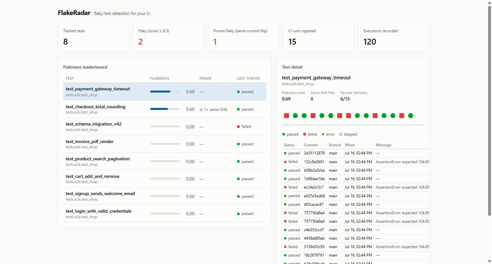

# FlakeRadar

**Self-hosted flaky-test detection for small engineering teams.**

Every time a developer clicks "re-run job" on a red CI build, evidence of a flaky
test evaporates. FlakeRadar captures that evidence: it ingests JUnit XML reports
from any CI system, tracks every test's outcome across runs *keyed by commit SHA*,
and scores flakiness statistically. A test that fails and then passes on the same
commit is **proven** nondeterministic — no heuristics required.



## Who it's for

Small and mid-size engineering teams (roughly 2–50 developers) who:

- run tests in CI (GitHub Actions, GitLab CI, Jenkins — anything that can emit
  JUnit XML) and have started to distrust red builds;
- catch themselves clicking **"re-run job"** as a reflex, without knowing which
  tests are actually unreliable;
- can't justify paid CI-analytics platforms (BuildPulse, Datadog CI Visibility)
  for a problem this size, but also can't afford the day a real regression hides
  behind "oh, that test is always flaky."

If you're a solo developer with a 30-second test suite, you don't need this yet.
If you're Google, you already built it in-house. Everyone in between: this is
the missing middle.

## What it does

- **One-line CI integration** — `curl` your `junit.xml` to `/api/ingest` after
  every test run (including failed ones). Works with pytest, Vitest, Jest, Go,
  JUnit, anything that emits JUnit XML.
- **Flakiness scoring that knows the difference between flaky and broken** —
  a test failing 100% of the time scores 0 (it's broken); a test that *flips*
  between pass and fail scores high. Recent flips weigh more (geometric decay),
  small samples are damped, and a same-commit fail→pass flip floors the score
  at 0.6 (proof beats statistics).
- **Dashboard** — flakiness leaderboard, per-test execution timeline with
  commit/branch/failure-message tooltips, summary tiles.
- **GitHub issue automation (optional)** — when a test crosses the flakiness
  threshold, FlakeRadar files a GitHub issue with the evidence: failure rate,
  last 10 executions, sample stack trace. One issue per test, never spammed.

## Quick start (local)

```bash
# Backend
cd backend
python -m venv .venv
.venv/Scripts/pip install -r requirements.txt      # Windows
# .venv/bin/pip install -r requirements.txt        # macOS/Linux
.venv/Scripts/python -m uvicorn app.main:app --port 8000

# Frontend (dev mode with hot reload, proxies /api to :8000)
cd frontend
npm install
npm run dev            # http://localhost:5173

# Or: build once and let FastAPI serve it
npm run build          # http://localhost:8000 now serves the app
```

Seed it with demo data:

```bash
backend/.venv/Scripts/python samples/simulate_ci.py
```

## Quick start (Docker)

```bash
cp .env.example .env   # set FLAKERADAR_API_TOKEN
docker compose up --build
# App + API on http://localhost:8000, data persisted in a named volume
```

Smoke-tested end-to-end: two-stage build (frontend compiled inside the image),
health check, static frontend serving, token auth rejection, authenticated
ingest, and data persistence across container restarts via the named volume.

## CI integration

Add one step after your tests (see `samples/github-actions-snippet.yml`):

```yaml
- name: Report to FlakeRadar
  if: always()   # crucial — failed runs are the signal
  run: |
    curl -sS -X POST "$FLAKERADAR_URL/api/ingest?commit_sha=$GITHUB_SHA&branch=$GITHUB_REF_NAME&ci_run_id=$GITHUB_RUN_ID-$GITHUB_RUN_ATTEMPT" \
      -H "X-API-Key: $FLAKERADAR_TOKEN" \
      --data-binary @junit.xml
```

The `run_attempt` suffix matters: it's what turns GitHub's "re-run failed jobs"
button into labeled flake data.

## GitHub issue automation

Set in `.env`:

```
FLAKERADAR_GITHUB_TOKEN=<fine-grained PAT with Issues:write>
FLAKERADAR_GITHUB_REPO=your-org/your-repo
FLAKERADAR_FLAKE_THRESHOLD=0.30
```

Leave blank to disable — everything else works without it. Issues are filed in
the background (never delays CI ingestion), deduplicated per test, labeled
`flakeradar`, and rate-limit aware.

## How scoring works

For each test, over its last 50 executions (configurable):

1. **Flip score** — the decayed rate of pass↔fail transitions between
   consecutive runs. Alternating forever → 1.0; always-fail or always-pass → 0.
2. **Sample damping** — one flip across two runs is 100% flip rate but weak
   evidence; confidence scales in until ~7 executions are recorded.
3. **Same-SHA floor** — any commit with both a pass and a fail recorded is
   proof of nondeterminism: the score is floored at 0.6, rising with each
   additional proven flip.

`skipped` executions are ignored; `error` counts as failing.

## API

| Endpoint | Auth | Purpose |
|---|---|---|
| `POST /api/ingest?commit_sha=&branch=&ci_run_id=` | `X-API-Key` | Upload JUnit XML (raw body or multipart `report` field, ≤20 MB) |
| `GET /api/tests?limit=&min_score=` | — | Flakiness leaderboard |
| `GET /api/tests/{id}/history?limit=` | — | Execution history for one test |
| `GET /api/summary` | — | Dashboard tiles |
| `GET /api/health` | — | Liveness |

Interactive docs at `/docs` (OpenAPI, auto-generated).

## Architecture

```
backend/   FastAPI + SQLAlchemy 2.0 + SQLite (swap DATABASE_URL for Postgres)
  app/
    ingest.py     JUnit parsing (junitparser), fingerprinting, persistence
    scoring.py    flip score + same-SHA proof (pure functions, unit-tested)
    github_integration.py  issue filing, background, fail-safe
    main.py       API routes + static hosting of frontend/dist
  tests/          35 tests (pytest): scoring, API, GitHub mocking
frontend/  React 18 + Vite + TypeScript, zero runtime chart deps (hand-rolled SVG)
samples/   CI snippet + demo-data simulator
```

Design notes:

- Schema is created with `Base.metadata.create_all` on startup — deliberate for
  a v1 single-table-growth app; introduce Alembic when the schema first changes.
- The read APIs are unauthenticated by design (dashboard is expected to sit on
  a private network / behind a reverse proxy). The write path is token-gated
  with constant-time comparison.
- Execution-status marks in the UI are shape-coded (circle/square/diamond/hollow)
  because pass-green vs fail-red collapses to ΔE 4.1 under deuteranopia —
  color never carries meaning alone.

## Development

```bash
cd backend
.venv/Scripts/python -m pytest        # 37 tests: scoring, API, GitHub mocking
cd ../frontend
npm run build                         # strict TypeScript is the frontend gate
```

Demo data: `backend/.venv/Scripts/python samples/simulate_ci.py` replays 15 CI
runs containing a flaky test, a same-SHA retry, a broken-every-run test, and
five stable tests — a quick way to see the scoring behave.

## Roadmap

- **Quarantine workflow** — mark a test quarantined in the UI; expose an API the
  test runner can query to auto-skip quarantined tests.
- **Branch filtering** in the dashboard (data is already recorded per branch).
- **Issue lifecycle** — auto-close the GitHub issue after N consecutive stable runs.
- **Retention** — pruning job for old executions.
- **Alembic migrations** — introduced at the first schema change.
- **Frontend test suite** (Vitest + Testing Library) as the UI grows.
